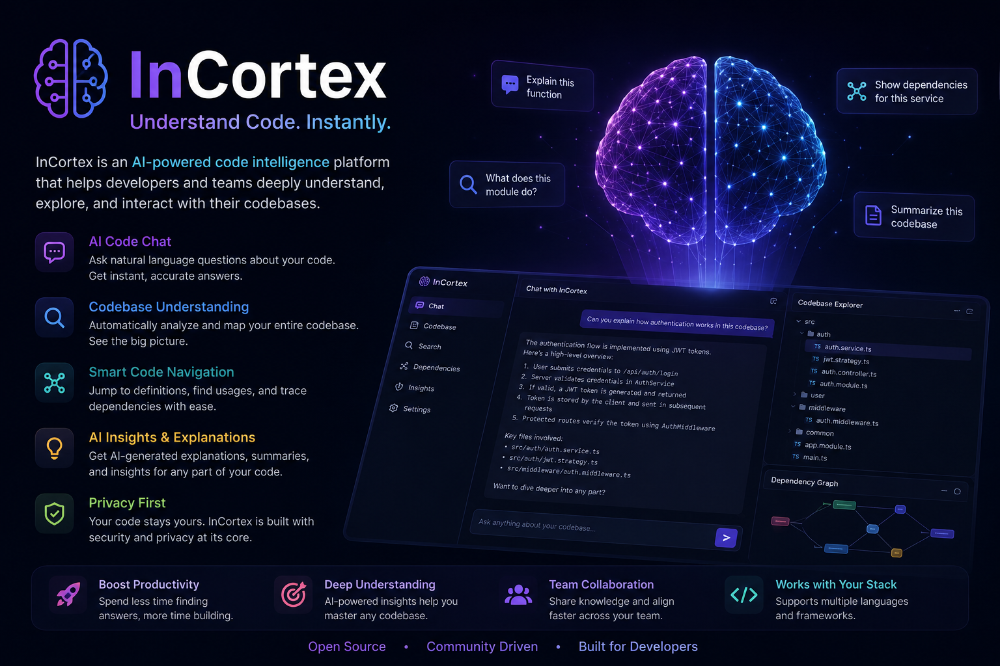

<div align="center">



# InCortex

**A biologically inspired, modular, self-learning cognitive architecture — built from Cells to Cortex.**


</div>

InCortex is an open-source, biologically inspired cognitive architecture for building modular, self-learning AI systems.

The project grows intelligence from the smallest unit, called a **Cell**, into larger structures such as **Tissues**, **Muscles**, **Organs**, and finally a **Cortex**. The goal is a safe, extensible, self-improving brain framework that can understand, remember, reason, speak, use tools, and learn from feedback.

InCortex is not one giant model. It is a **living system of connected intelligence modules**.

> 🧬 **Project status: Phase 6 — Voice System implemented.** The brain now has an **Ear and a Mouth** ([`incortex/speech/`](incortex/speech/)): on macOS, `python scripts/run_voice.py` speaks its replies aloud through the system voice, real audio transcription activates with the optional `voice` extra (Whisper), and a mumbled input is asked to repeat itself before the brain is bothered — hearing has a confidence too. Memory persists between runs (SQLite + vector retrieval with a forgetting curve), learning accumulates (JSONL history + mistake clustering into remembered weaknesses). Plain-language walkthroughs live in [docs/understanding/](docs/understanding/); the full architecture is in [Design_Doc.md](Design_Doc.md), build order in [ROADMAP.md](ROADMAP.md).

---

## Biological Development Model

```text
Cell → Tissue → Muscle → Organ → Cortex → Brain
```

| Biology        | InCortex                                          |
| -------------- | ------------------------------------------------- |
| Cell           | Smallest intelligent processing unit              |
| Tissue         | Group of related Cells                            |
| Muscle         | Action/execution module                           |
| Organ          | Specialized intelligence subsystem                |
| Nervous System | Message bus and communication layer               |
| Cortex         | Higher reasoning, planning, learning              |
| Memory         | Short-term, long-term, episodic, semantic storage |
| Mouth / Ear    | Text-to-speech / speech-to-text                   |
| Learning       | Feedback, scoring, memory update, retraining      |

## The Cognitive Loop

Every interaction flows through one loop — the foundation of the InCortex brain:

```text
Listen → Understand → Remember → Reason → Plan → Act → Speak → Learn
```

## Architecture at a Glance

```text
+--------------------------------------------------+
|                  User Interface                  |
|      CLI / Web App / Voice / API / Desktop App   |
+--------------------------------------------------+
                         |
+--------------------------------------------------+
|                  InCortex Core                   |
|     Router / Scheduler / State / Message Bus     |
+--------------------------------------------------+
        |               |                |
+---------------+ +---------------+ +---------------+
| Language      | | Memory        | | Reasoning     |
| Organ         | | Organ         | | Organ         |
+---------------+ +---------------+ +---------------+
        |               |                |
+---------------+ +---------------+ +---------------+
| Planning      | | Learning      | | Safety        |
| Organ         | | Organ         | | Organ         |
+---------------+ +---------------+ +---------------+
        |               |                |
+--------------------------------------------------+
|                  Muscle System                   |
|   Speak / Search / Code / File / API / Tools     |
+--------------------------------------------------+
                         |
+--------------------------------------------------+
|                  Output System                   |
|           Text Response / Speech / Actions       |
+--------------------------------------------------+
```

Every component communicates through a standard `CortexMessage`, and every Cell follows the same contract:

```text
Input → Process → Output → Learn → Report Health
```

Just as a neural network is defined by its equations, every InCortex layer has a formal mathematical model — activations, confidence and health scores, memory decay curves, learning updates, and risk gates are all specified in [docs/math_model.md](docs/math_model.md), with a file-by-file equation map.

## Project Structure

```text
incortex/
├── core/          # Cortex Core: router, scheduler, message bus, state
├── cells/         # Smallest intelligent units (IntentCell, MemoryCell, ...)
├── tissues/       # Groups of cooperating Cells (LanguageTissue, ...)
├── organs/        # Specialized subsystems (Memory, Reasoning, Safety, ...)
├── muscles/       # Action/execution modules (speech, files, code, APIs)
├── memory/        # Short-term, long-term, vector, episodic memory
├── learning/      # Feedback, evaluation, mistake tracking, skills
├── safety/        # Permissions, risk levels, policies, human approval
├── tools/         # Tool registry and controlled external abilities
├── api/           # FastAPI service (/v1/chat, /v1/memory, /v1/feedback)
└── interfaces/    # CLI, web, and voice front-ends

docs/              # Architecture, memory, learning, and safety docs
examples/          # Runnable demos (chat, memory, feedback, voice)
tests/             # Unit, integration, safety, and learning tests
scripts/           # Dev utilities (init DB, run CLI, run API)
```

Each directory contains a README describing its role and planned modules. See [Design_Doc.md §20](Design_Doc.md) for the full file-level layout.

## Roadmap

| Phase | Focus                                    |
| ----- | ---------------------------------------- |
| 0     | Project foundation and scaffolding       |
| 1     | **Cell system** — smallest unit of intelligence |
| 2     | Tissue system — Cells cooperating        |
| 3     | Organ system — specialized subsystems    |
| 4     | Cortex Core — central coordination       |
| 5     | Memory and learning                      |
| 6     | Voice (Ear and Mouth)                    |
| 7     | Tools and Muscles with safety gates      |
| 8     | Development Organ — safe self-development |
| 9     | Advanced learning (self-evaluation, skills, fine-tuning) |

Details, deliverables, and success criteria live in [ROADMAP.md](ROADMAP.md).

## First Milestone — v0.1 "Cell Genesis"

A working Cell system with memory, feedback, and a simple command-line chat interface:

```text
User:     Teach yourself what photosynthesis is.
InCortex: I have learned that photosynthesis is the process plants use
          to make food from sunlight, water, and carbon dioxide.

User:     Remember that I like very simple explanations.
InCortex: Got it. I will explain future topics in simple English.

Later —
User:     Explain neural networks.
InCortex: A neural network is a computer system that learns patterns,
          like how your brain learns from examples.
```

This demo proves input understanding, memory storage and retrieval, response generation, feedback learning, and personalization.

## Tech Stack (MVP)

```text
Python 3.11+ · FastAPI · Pydantic · Uvicorn
SQLite (structured memory) · ChromaDB or FAISS (vector memory)
JSONL event logs · pytest · Typer/Click CLI
```

## Safety First

InCortex is built around **human control**:

- Clear permission levels (0–5); code execution and system-level actions require human approval.
- No uncontrolled self-modification — InCortex may *suggest* changes to itself, never merge them.
- Transparent logs, reversible memory, and no private data storage without permission.
- Users can view, edit, delete, disable, and export memory at any time.

See [docs/safety_model.md](docs/safety_model.md) and [Design_Doc.md §25](Design_Doc.md).

## Contributing

InCortex is open source and community driven. Good first areas: new Cell types, memory search, unit tests, CLI output, documentation, and examples. See [CONTRIBUTING.md](CONTRIBUTING.md).

## Design Principle

```text
Small intelligent parts first.
Clear communication between parts.
Memory at every level.
Learning after every action.
Human approval for risky behavior.
```

## License

[MIT](LICENSE) — free to use, modify, and distribute.
